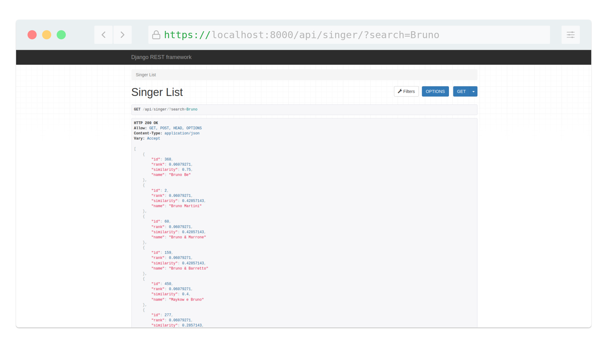

# django-full-text-search

Projeto que implementa o Full-Text search do Postgres com o django, tentando aproximar do sistema feito pelo [Leandro Proença](https://leandronsp.com/a-powerful-full-text-search-in-postgresql-in-less-than-20-lines). O texto sobre essa implementação tá disponível no [dev.to](https://dev.to/eduardojm/full-text-search-implementando-com-postgres-e-django-kmf).

---

## Como executar o projeto

O projeto pode ser executado facilmente utilizando o `docker` e `docker-compose`:

### Clonar o Repositório

```bash
git clone https://github.com/EduardoJM/django-full-text-search.git
cd django-full-text-search
```

### Executar o Projeto

```bash
docker-compose up --build
```

### Abrir o Navegador



## Versões dos Textos

### Full-Text Search: Implementando com Postgres e Django

A versão do código desenvolvido durante o texto `Full-Text Search: Implementando com Postgres e Django` está disponível na branch [texto-1](https://github.com/EduardoJM/django-full-text-search/tree/texto-1).

### Full-Text Search: Criando um Back-End de Filtro para o Django Rest-Framework

A versão do código desenvolvido durante o texto `Full-Text Search: Criando um Back-End de Filtro para o Django Rest-Framework` está disponível na branch [texto-2](https://github.com/EduardoJM/django-full-text-search/tree/texto-2).
